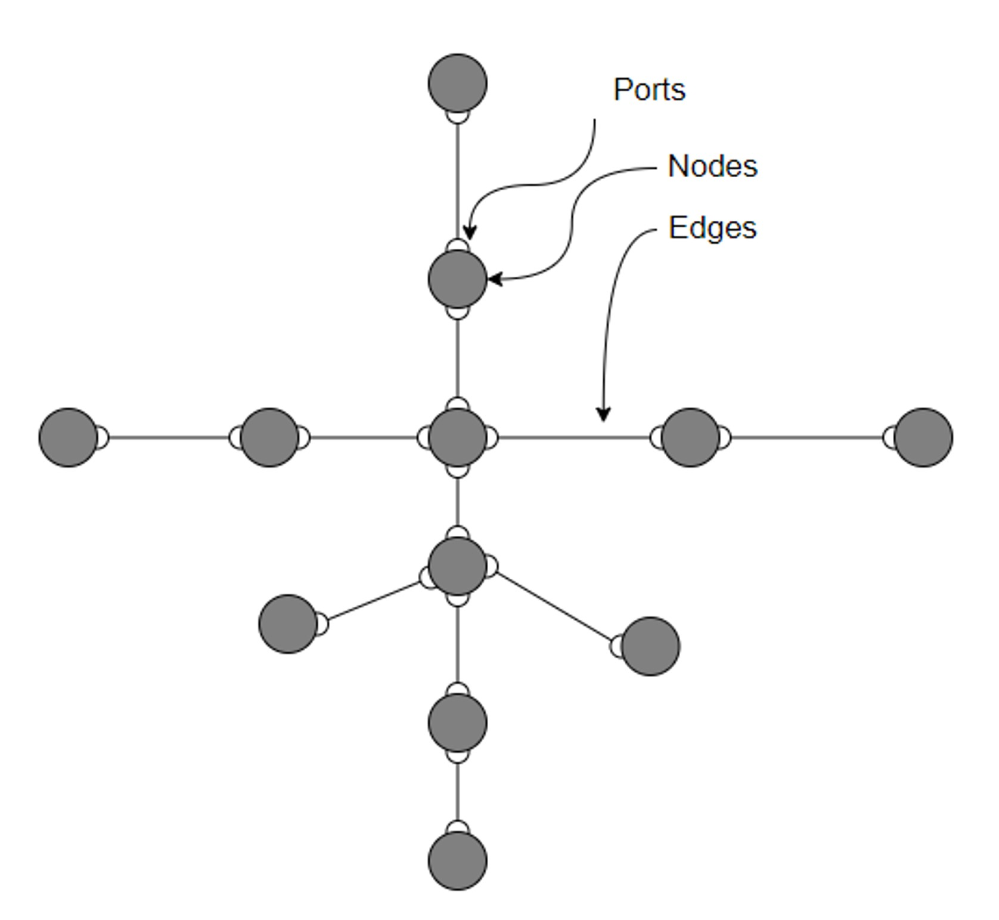

User Guide
==============

Design Philosophy
---------------------
Echo models multi-commodity energy systems as networks comprised of **edges**, **ports**,
and **nodes**.
Nodes represent physical assets of the energy network (at different levels of aggregation) and logical interconnection points. Each Node has at least one Port.
Port represents the flow of a single commodity into or out of a Node. Nodes that have multiple Ports also define a Transformation of the commodity between their Ports.
Edges represents physical flows of a single commodity between two network Nodes (assets). Ports also represent the connection of an Edge to a Node.

Creating a model
---------------------------

Creating a model using the builder (recommended)
^^^^^^^^^^^^^^^^^^^^^^^^^^^^^^^

Creating a model from scratch
^^^^^^^^^^^^^^^^^^^^^^^^^^^^^^^

Loading model from external file
^^^^^^^^^^^^^^^^^^^^^^^^^^^^^^^^

